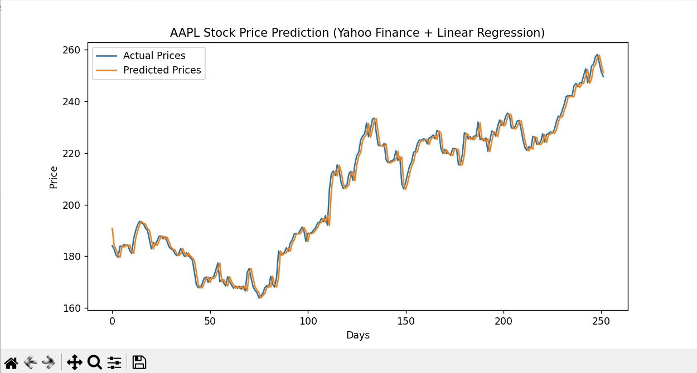

# 📈 Stock Price Predictor (Tiingo API)

A simple stock price predictor that uses Tiingo API data and Linear Regression to forecast the next day's close.

## Features
- Pulls historical stock data from Tiingo API
- Uses Linear Regression for next-day prediction
- Visualizes actual vs predicted prices

## Installation
```bash
pip install -r requirements.txt
```

Run:
```bash
python stock_predictor.py
```

## Example Output

